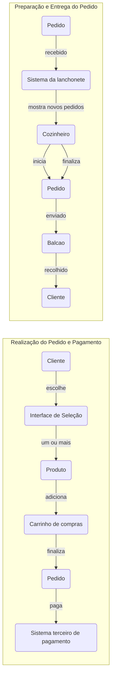

# Lanchonete do Bairro
##### versão 1.0.0-POC

A Lanchonete do Bairro é um estabelecimento acolhedor e familiar localizado no coração da comunidade. Com um ambiente descontraído e amigável, é o lugar perfeito para os moradores e visitantes desfrutarem de deliciosas opções de lanches, acompanhamentos, bebidas e sobremesas.


## Projeto 

O projeto Lanchonete do Bairro tem como objetivo desenvolver um sistema de gerenciamento para uma lanchonete familiar. O sistema será desenvolvido utilizando a arquitetura hexagonal (hexagonal architecture) e seguirá os princípios do Domain-Driven Design (DDD).

Através desse sistema, os clientes terão acesso a uma interface intuitiva onde poderão realizar pedidos e efetuar pagamentos de forma prática. Será possível montar o combo de lanches com opções de lanche, acompanhamento e bebida. O sistema também permitirá que os clientes acompanhem o progresso do seu pedido, desde a confirmação até a entrega ou retirada.

Além das funcionalidades voltadas para os clientes, o sistema contará com um painel administrativo que permitirá o gerenciamento de clientes, produtos e categorias. O estabelecimento poderá cadastrar novos clientes, gerenciar campanhas promocionais, adicionar, editar e remover produtos, definindo nome, categoria, preço, descrição e imagens. Também será possível acompanhar os pedidos em andamento e verificar o tempo de espera de cada pedido.

O projeto será desenvolvido utilizando a linguagem de programação Java 16 e o framework Spring Boot. Será integrado ao banco de dados MariaDB para armazenar as informações dos clientes, produtos e pedidos. Além disso, o projeto incluirá a documentação do sistema utilizando a linguagem ubíqua (DDD) e a implementação de endpoints RESTful para as funcionalidades descritas.

Com o projeto Lanchonete do Bairro, pretendemos criar um sistema eficiente e intuitivo que facilite o processo de pedido e pagamento, proporcionando uma experiência agradável aos clientes e auxiliando o estabelecimento


### Swagger

A documentação técnica da API pode ser acessada na URI [/swagger-ui/index.html](http://localhost:8080/swagger-ui/index.html)

### Linguagem Ubíqua

1.	Lanchonete: Estabelecimento que oferece uma variedade de alimentos e bebidas.
2.	Cliente: Pessoa que faz um pedido na lanchonete.
3.	Pedido: Solicitação de alimentos e/ou bebidas feita por um cliente.
4.	Produto: Produtos que compoem um pedido
5.	Acompanhamento: Opção adicional selecionada pelo cliente para acompanhar seu lanche.
6.	Lanche: Alimento principal do pedido, como hamburguês, pizza, etc.
7.	Acompanhamento: Alimento secundário do pedido, como batata frita, salada, etc.
8.	Bebida: Opção de bebida selecionada pelo cliente.
9.	Sobremesa: Complemento da alimentação.
10.	Pagamento: Processo de efetuar o pagamento do pedido.
11.	Sistema de Pedido: Tela ou dispositivo no estabelecimento que mostra o status do pedido em diferentes etapas para os clientes e para a equipe da cozinha.
12.	Equipe da cozinha: Funcionários responsáveis por preparar os pedidos.
13.	Status do Pedido: Indicador do progresso do pedido, dividido em:

       - a. Recebido: Pedido registrado e aguardando preparação.
       - b. Em preparação: Pedido em processo de preparação na cozinha.
       - c. Pronto: Pedido concluído e pronto para retirada.
       - d. Finalizado: Pedido entregue e finalizado.

9.	Entrega: Processo de notificar o cliente quando o pedido está pronto para retirada.
10.	Acompanhamento de Pedidos: Funcionalidade que permite acompanhar o status dos pedidos em andamento e estimar o tempo de espera.
11.	Balcão de recolha: Local físico onde os pedidos são entregas quando finalizado para a recolha pelo cliente.


### Fluxo de Funcionalidades (Representação Pictográfica)



#### Explicação do Fluxo:

Realização do pedido e pagamento:

1. O cliente inicia o processo selecionando um pedido na interface de seleção.
2. O cliente pode adicionar um lanche, um acompanhamento, uma bebida e uma sobremesa ao seu carrinho de compras.
3. Após selecionar todos os itens desejados, o cliente avança para o sistema de pagamento.
4. No sistema de pagamento, o cliente insere as informações de pagamento e conclui a transação. 
 
Preparação e entrega do pedido:

1. Após a conclusão do pagamento, o pedido é enviado para a cozinha através de um monitor de pedidos.
2. O cozinheiro recebe a notificação de um novo pedido.
3. O cozinheiro confirma o pedido e inicia o processo de preparação.
4. Quando o pedido é preparado, o cozinheiro atualiza o status do pedido para 'em preparação'.
5. Após a preparação do pedido, o cozinheiro atualiza o status para 'pronto'.
6. O pedido é entregue ao cliente.
7. Ao entregar o pedido, o status do pedido é atualizado para 'finalizado'.

### Arquitetura hexagonal

A arquitetura hexagonal, foi utilizada pois permite criar sistemas flexíveis, testáveis e independentes de tecnologias externas.

A principal razão para utilizar a arquitetura hexagonal foi sua capacidade de isolar o núcleo do sistema, onde estão as regras de negócio essenciais, das dependências externas, como bancos de dados e frameworks. Essa separação possibilita o desenvolvimento e teste independentes do núcleo, facilitando a manutenção do código.

Além disso, também proporciona flexibilidade e adaptabilidade ao sistema. Ao definir as interfaces externas como portas de entrada e saída, é possível substituir ou adicionar adaptadores para conectar-se a diferentes tecnologias ou serviços externos, sem afetar o núcleo da aplicação. Isso torna o sistema mais preparado para lidar com mudanças de requisitos e tecnologias.

### Verificação de integridade (Health Check)

O Health Check é um mecanismo que permite verificar o estado de saúde de um sistema ou serviço em tempo real. Ele é usado para monitorar e validar se o sistema está funcionando corretamente, fornecendo informações sobre sua disponibilidade e desempenho.

No contexto deste projeto, o Health Check foi implementado para garantir a integridade e a estabilidade do sistema. Ele permite que os administradores ou ferramentas de monitoramento verifiquem a saúde da aplicação de forma automatizada. O projeto utiliza o Health Check para fornecer um endpoint específico, '/actuator/health', que retorna informações sobre o estado do sistema, incluindo o status atual. Isso é útil para identificar problemas e tomar ações corretivas, garantindo a disponibilidade e a qualidade do serviço. Ao utilizar o Health Check, o projeto busca facilitar o monitoramento e o diagnóstico de problemas, contribuindo para uma melhor experiência do usuário e um ambiente mais confiável.

Alguns endpoints úteis:

- [/actuator/health](http://localhost:8080/actuator/health): Informações de saúde da aplicação, incluindo o status do banco de dados.
- [/actuator/info](http://localhost:8080/actuator/health): Informações gerais sobre a aplicação, incluindo informações sobre o banco de dados.
- [/actuator/metrics](http://localhost:8080/actuator/health): Métricas da aplicação, como tempo de execução de consultas no banco de dados.


### Como rodar o projeto

#### Prerequisitos
- [x] Docker instalado e rodando
- [x] Gradle instalado
- [x] Java 17

#### Comandos
Uma vez dentro da raiz do projeto rode o seguinte comando em um terminal

```
 docker build -t lanchonete-do-bairro-image .
 docker run -d --name lanchonete-do-bairro-container -p 3306:3306 lanchonete-do-bairro-image 
 ./gradlew bootRun
```