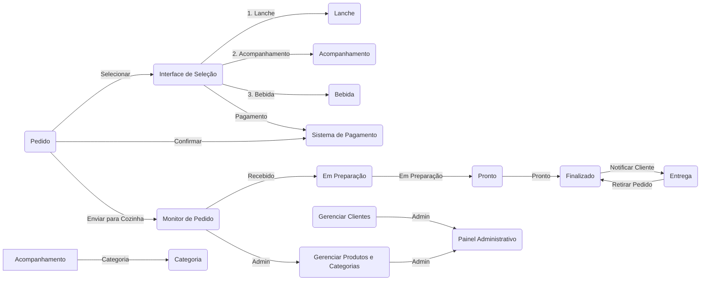

# Lanchonete do Bairro
##### versão 1.0.0-POC

A Lanchonete do Bairro é um estabelecimento acolhedor e familiar localizado no coração da comunidade. Com um ambiente descontraído e amigável, é o lugar perfeito para os moradores e visitantes desfrutarem de deliciosas opções de lanches, acompanhamentos, bebidas e sobremesas.


## Projeto 

O projeto Lanchonete do Bairro tem como objetivo desenvolver um sistema de gerenciamento para uma lanchonete familiar. O sistema será desenvolvido utilizando a arquitetura hexagonal (hexagonal architecture) e seguirá os princípios do Domain-Driven Design (DDD).

Através desse sistema, os clientes terão acesso a uma interface intuitiva onde poderão realizar pedidos e efetuar pagamentos de forma prática. Será possível montar o combo de lanches com opções de lanche, acompanhamento e bebida. O sistema também permitirá que os clientes acompanhem o progresso do seu pedido, desde a confirmação até a entrega ou retirada.

Além das funcionalidades voltadas para os clientes, o sistema contará com um painel administrativo que permitirá o gerenciamento de clientes, produtos e categorias. O estabelecimento poderá cadastrar novos clientes, gerenciar campanhas promocionais, adicionar, editar e remover produtos, definindo nome, categoria, preço, descrição e imagens. Também será possível acompanhar os pedidos em andamento e verificar o tempo de espera de cada pedido.

O projeto será desenvolvido utilizando a linguagem de programação Java 16 e o framework Spring Boot. Será integrado ao banco de dados MariaDB para armazenar as informações dos clientes, produtos e pedidos. Além disso, o projeto incluirá a documentação do sistema utilizando a linguagem ubíqua (DDD) e a implementação de endpoints RESTful para as funcionalidades descritas.

Com o projeto Lanchonete do Bairro, pretendemos criar um sistema eficiente e intuitivo que facilite o processo de pedido e pagamento, proporcionando uma experiência agradável aos clientes e auxiliando o estabelecimento


### Swagger

A documentação técnica da API pode ser acessada na URI [/swagger-ui/index.html](http://localhost:8080/swagger-ui/index.html)

### Linguagem Ubíqua

1. Lanchonete: Estabelecimento que oferece uma variedade de alimentos e bebidas.
2. Cliente: Pessoa que faz um pedido na lanchonete.
3. Pedido: Solicitação de alimentos e/ou bebidas feita por um cliente.
4. Acompanhamento: Opção adicional selecionada pelo cliente para acompanhar seu lanche.
5. Bebida: Opção de bebida selecionada pelo cliente.
6. Pagamento: Processo de efetuar o pagamento do pedido.
7. Monitor de Pedido: Tela ou dispositivo no estabelecimento que mostra o status do pedido em diferentes etapas.
8. Status do Pedido: Indicador do progresso do pedido, dividido em:
- a. Recebido: Pedido registrado e aguardando preparação.
- b. Em preparação: Pedido em processo de preparação na cozinha.
- c. Pronto: Pedido concluído e pronto para retirada.
- d. Finalizado: Pedido entregue e finalizado.
9. Entrega: Processo de notificar o cliente quando o pedido está pronto para retirada.
10. Estabelecimento: Responsável pela gestão do sistema da lanchonete.
11. Gerenciar Clientes: Funcionalidade que permite ao estabelecimento gerenciar informações dos clientes cadastrados.
12. Gerenciar Produtos e Categorias: Funcionalidade que permite ao estabelecimento adicionar, modificar ou remover produtos e categorias do cardápio.
13. Acompanhamento de Pedidos: Funcionalidade que permite acompanhar o status dos pedidos em andamento e estimar o tempo de espera.

### Fluxo de Funcionalidades (Representação Pictográfica)



#### Explicação do Fluxo:

1. O cliente seleciona os itens do pedido na interface de seleção.
2. O cliente confirma o pedido.
3. O pedido é enviado para o sistema de pagamento integrado.
4. Após o pagamento, o pedido é confirmado.
5. O pedido é exibido no monitor de pedido na cozinha.
6. O pedido passa pelas etapas de "Recebido", "Em Preparação", "Pronto" e "Finalizado".
7. O cliente é notificado quando o pedido está pronto para retirada.
8. O cliente retira o pedido e o status é atualizado para "Finalizado".
9. O estabelecimento pode gerenciar os clientes cadastrados e as informações dos produtos e categorias através do painel administrativo.
10. O estabelecimento pode acompanhar os pedidos em andamento e estimar o tempo de espera.

### Arquitetura hexagonal

A arquitetura hexagonal, foi utilizada pois permite criar sistemas flexíveis, testáveis e independentes de tecnologias externas.

A principal razão para utilizar a arquitetura hexagonal foi sua capacidade de isolar o núcleo do sistema, onde estão as regras de negócio essenciais, das dependências externas, como bancos de dados e frameworks. Essa separação possibilita o desenvolvimento e teste independentes do núcleo, facilitando a manutenção do código.

Além disso, também proporciona flexibilidade e adaptabilidade ao sistema. Ao definir as interfaces externas como portas de entrada e saída, é possível substituir ou adicionar adaptadores para conectar-se a diferentes tecnologias ou serviços externos, sem afetar o núcleo da aplicação. Isso torna o sistema mais preparado para lidar com mudanças de requisitos e tecnologias.

### Como rodar o projeto

#### Prerequisitos
- [ ] Docker instalado e rodando
- [ ] Gradle instalado
- [ ] Java 17

#### Comandos
Uma vez dentro da raiz do projeto rode o seguinte comando em um terminal

```
 docker build -t lanchonete-do-bairro-image .
 docker run -d --name lanchonete-do-bairro-container -p 3306:3306 lanchonete-do-bairro-image 
 ./gradlew bootRun
```